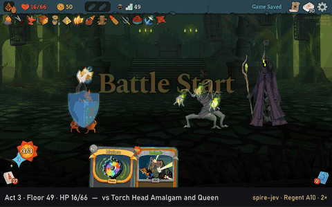
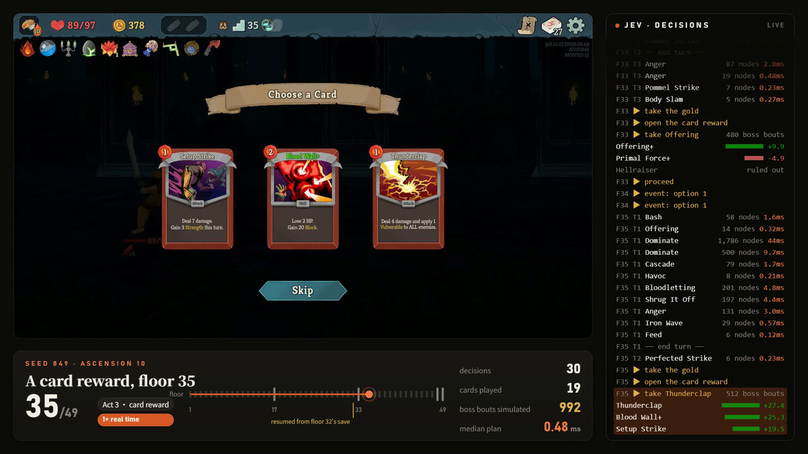

# spire-jev

A bot that plays Slay the Spire 2 in the real game — Ironclad, whole runs, no human input.
A mod bridges the game to a planner in TypeScript: each turn a simulator of the game's
combat searches the order to play the hand in, well under a millisecond at the median, and
the choices around the fights (card rewards, the path, rest sites, shops, events) are made
by rules. The simulator is checked against the game card by card, and the results below are
counted on seeds the rules were not tuned on.

https://github.com/user-attachments/assets/3398cbf3-1c98-44e3-91c5-41305deeca78

*Ascension 10, seed 849, the last two floors at game speed: the first A10 win, and beside the
game what the bot decided — every card it played, the positions its search expanded for it and
the milliseconds that took. Aeonglass took it from 100 HP to 3; Burning Blood and Pantograph
brought it to 34 for the Test Subject, beaten with 18 left. The decisions are the log of a
headless replay of the same run, which matches the recording card for card, laid beside it
(the overlay is made outside this repository; without it, the two floors as a GIF:
[docs/media/a10-849-floor48-49-2x.gif](docs/media/a10-849-floor48-49-2x.gif)).
A narrow win, not a win rate: it was replayed from the run's floor-32 save (act 2's boss on),
one of 97 such saves that was won, on the development rules, which are newer than the code
here (`--flags pathdp,restbudget,potions2,sleep,spar,spar3`). The replay from floor 32:
[docs/media/a10-849-run.mp4](docs/media/a10-849-run.mp4) (2 min 52 s for 8.9 minutes of play;
its last card reads 0 HP because the game's closing event takes it after the final boss).*

### The Regent: a win from floor 1



*Ascension 10, seed 3019, the Regent (2026-09-30): the last fight at 2×, the Queen falling
with the bot on 6 of 66 HP. Unlike 849 this run was played from floor 1 to floor 49 in one go,
no save in between: 20 fights, 20 won, 456 cards in 560 decisions (p50 2.0 ms, p95 122 ms).
Its bosses, HP going in → left at the end (of 66): Kin Priest 57 → 55, Crusher and Rocket
51 → 12, Aeonglass 60 → 16, Torch Head Amalgam and the Queen 14 → 6. A narrow win, not a win
rate: 1 of the 20 fresh seeds (3001–3020) this configuration played was won, and the 20 reached
floor 29.4 on average. It was recorded on `45d61d8`, the Regent branch before it was rebased;
the characters other than the Ironclad are now in this repository (`planner/src/characters/`,
[docs/CHARACTERS.md](docs/CHARACTERS.md)). The configuration is the best so far
(`--choices rules2 --flags pathdp,restbudget,potions2,sleep,spar,spar3,spar5,spar4up,spar4shop,powbonus,spartake,halllook1,lookfix`).
The recording matches the headless run fight for fight. The whole run:
[docs/media/a10-regent-3019-run.mp4](docs/media/a10-regent-3019-run.mp4) (4 min 34 s for 28
minutes of play, fights 2×, the rest 8×).*

### Three climbs to act 3

The three runs that reached act 3's bosses, in the order the rules came, each on the code of its
time and counted from its own logs:

| seed | rules | how far | fights won | combat decisions (p50 / p95) | cards played | card picks and buys played out (bouts) |
|---|---|---|---|---|---|---|
| [707](docs/media/a10-707-run.mp4) | before `spar` | floor 48: died to the Queen, 279 HP left in her | 21 of 22 | 514 (0.14 / 2.4 ms) | 417 | none: by the rules |
| [497](docs/media/a10-497-run.mp4) | `spar` | floor 49: died to the Test Subject, one fight short | 19 of 20 | 437 (0.13 / 1.1 ms) | 338 | 55 (9,216) |
| [849](docs/media/a10-849-run.mp4) | `spar3`; floors 32–49 from its save | floor 49 of 49: won | 24 of 24 | 428 (0.21 / 7.9 ms) | 355 | 27 (14,144) |

A fight's decisions take well under a millisecond at the median; a card pick played out takes
seconds (849's, with `spar3`'s closer look, 243 s over the run). The GIFs of 497's and 707's last
fights are in [docs/RECORDING.md](docs/RECORDING.md). All three runs in 3 minutes, in the game's
Chinese interface with the same feed of decisions beside it:
[on Bilibili](https://www.bilibili.com/video/BV16iax6xEtv) (in Chinese; the fights sped up 2–12×,
the rest up to 60×, as the corner says).

https://github.com/user-attachments/assets/16900a43-facf-4d3e-a3b5-e86fd102826f

*A progress video, in Chinese (5 min 23 s, 1080p, 48 MB):
[docs/media/spire-jev-849-progress-zh.mp4](docs/media/spire-jev-849-progress-zh.mp4). The four days
from the first headless game to the first A10 win, the results on fresh seeds, where the limit
turned out to be (the simulator more than the planner), the changes kept and the ones dropped, and
seed 849's whole run, floors 1 to 49, in the game's Chinese interface. Its figures are from the
development work since this code. The run is two recordings joined
where the win was: floors 1–32 as the evaluation that saved floor 32 played them, floors 32–49 from
that save on the newer rules. How, and the one card reward the first had to skip as the original
did: [docs/RECORDING.md](docs/RECORDING.md).*

Slay the Spire 2 is Mega Crit's; this project is not affiliated with Mega Crit, and the
repository holds no game files — the bridge runs against a local install. The name is for
the shape of a "System One" decision layer (fast search where search is right, one-token
judge questions for the calls around it); nothing here calls TypeSafe's Jev API, and today
no model is involved at all.

## Where it stands

**The first Regent win, and the first from floor 1 (2026-09-30):** seed 3019, on the Regent's
rules as they stood then (`45d61d8`, the branch before its rebase), 1 of 20 fresh seeds; see
[The Regent](#the-regent-a-win-from-floor-1) above.

**The first A10 win (2026-09-26):** seed 849, replayed from its floor-32 save on the development
rules (`spar3` and later), beat act 2's boss and both of act 3's —
1 of those 97 floor-32 saves, and narrowly (details in [docs/RECORDING.md](docs/RECORDING.md)).
The table below is still the confirmation set on the rules published here.

Ironclad at ascension 10, the game's beta v0.111.0, on a profile that has seen every act
and boss (so runs are drawn as for a player past their first). The best configuration so
far (`--choices rules2 --flags pathdp,restbudget,potions2,sleep,spar`) on the 90
confirmation seeds (496–585), which no change was tuned on:

| | |
|---|---|
| runs won | **0 of 90** |
| mean floor reached | 25.0 of 49 (22.0 before `spar`, same seeds) |
| act 1's boss beaten | 56 of 79 reached (71%) |
| act 2's boss beaten | 7 of 30 reached (23%) |
| act 3's first boss beaten (floor 48) | 1 of 5 reached |
| fights won | 850 of 937 |
| planning time per decision | p50 0.09 ms, p95 1.3 ms, max 385 ms |
| end-of-turn HP loss predicted exactly | 3387 of 3461 turns |

The furthest run is seed 497 in that set: it beat act 3's first boss, Aeonglass, on floor
48 (120 → 48 HP). There the game's automated-play framework gave the run up — it stops at
floor 49, where A10 puts a second boss — so until the bridge was fixed no A10 run could be
won. Replayed with the fix, 497 met the second boss, Test Subject, with 48 HP and died on
its fourth turn, after the Test Subject's revival: one fight from a win. It is the only run
of the 90 that the stop cut short. 34 of the 90 runs end in act 1; past it the deck is the limit more than the play (act 2's
bosses beaten 7 of 30). The last change that counted, `spar` (card rewards and shop picks
by what they add against the act's own boss, played out in the simulator), was developed on
seeds 316–495, where it took act 1's boss from 48% to 63% and the mean floor from 20.1 to
23.8, paired. The working record — every change measured, the ones that were noise, the ones
that made things worse — is [docs/PLAN.md](docs/PLAN.md).

## How it plays

- **The bridge** (`mod/Bridge`, C#, loaded by the game's own mod loader) drives the game
  through its automated-play framework: it reports every decision the game waits on — a
  fight, the map, a reward, a card to pick, a shop, an event — with what the planner needs
  (cards' real numbers, intents, powers, the draw pile), and plays the answer. It runs the
  game headless in a sandbox of its own, several at once; with `SPIRE_JEV_VISUAL=1` it runs
  on screen instead.
- **Fights** (`planner/src/sim.ts`, `search.ts`, `turn.ts`): a simulator of the cards,
  powers, relics, potions and the bosses' move scripts, and a search over the orders a hand
  can be played in, equal states merged. Each rule was written from what the game did and
  is pinned by a test; after every card the simulator's prediction is compared with the
  game. Early on, 2482 cards on 15 seeds left 42 fields that differed, all on four things
  approximated on purpose; over the 90 confirmation runs, which meet cards and monsters those
  seeds never did, 13,068 cards left 746.
- **Everything else** (`planner/src/choices.ts`, `path.ts`, `spar.ts`): card values from
  tier lists and pick rates (`docs/STRATEGY-research.md`), a path chosen over the whole map,
  a budget for HP at rest sites, potions drunk by rule, and card picks tried out against the
  act's boss.



*Seed 849, floor 35: a card reward as `spar3` decides it. Each offer is added to the deck and
the deck fights the act's boss in the simulator, 32 shuffles, and 128 more for an offer near
the line or near the best; the pick is the best gain of at least 5 (Thunderclap, from 512 bouts
in 13 s). Above it, the fights' decisions: the card played, the positions searched, the time.*

## Running it

It needs Slay the Spire 2 installed at the beta v0.111.0, the .NET 9 SDK (for the bridge)
and Node 24 (the planner runs its TypeScript directly, with no dependencies). The game's
folder is `D:\SteamLibrary\steamapps\common\Slay the Spire 2` unless `STS2_GAME_ROOT` says
otherwise (and `-p:GameDataDir=<game>\data_sts2_windows_x86_64` for the build).

```bash
cd mod/Bridge && dotnet build -c Release          # the bridge, into bin/Release/net9.0/package
                                                  # (-c Visual as well, for record.ts)
cd planner
npm test                                          # the simulator's rules and the planner, no game needed
node src/run-fights.ts --seed 316 --runs 1 --port 47100 --cards take \
  --choices rules2 --ascension 10 --flags pathdp,restbudget,potions2,sleep,spar
node src/eval.ts --tag mine --seeds 316-345 --sandboxes 4 --choices rules2 --ascension 10 \
  --flags pathdp,restbudget,potions2,sleep,spar   # several sandboxes at once, about 1 GB each
node src/record.ts --seed 316 --ascension 10       # one run on screen, recorded (docs/RECORDING.md)
```

A sandbox is `sandbox/p<port>`: hard links to the game's files, its own mods folder and
profile, so the real install and saves are never touched.

## Layout

| | |
|---|---|
| `mod/Bridge` | the game-side bridge, derived from divine-sts2's FullAppBridge |
| `planner/src` | simulator, search, choices, and the runners (`run-fights`, `eval`, `bench`, `record`) |
| `planner/test` | the rules, each against what the game did |
| `planner/data` | card, monster and intent tables read from the game; a veteran profile |
| `docs` | the plan and its measurements, strategy research, the recording |
| `tools` | the first spike, and an inspector for the game's types |

## Provenance

The bridge began as divine-sts2's FullAppBridge (MIT, [mod/LICENSE-divine-sts2](mod/LICENSE-divine-sts2))
and was extended for what a planner needs. `planner/data/card-stats-a10.json` is Spire
Codex's ascension-10 Ironclad data, and the strategy notes in `docs/` summarise public
guides and statistics and say where each comes from.

## License

The code written for this project is MIT — see [LICENSE](LICENSE). The bridge's parts from
divine-sts2 stay under their own MIT license ([mod/LICENSE-divine-sts2](mod/LICENSE-divine-sts2)).
Not covered, and not ours to license: Slay the Spire 2 and its art and text, which are Mega
Crit's and appear in the recordings in `docs/media`; the tables and profile saves in
`planner/data` read from the game; and Spire Codex's data in `planner/data/card-stats-a10.json`.
